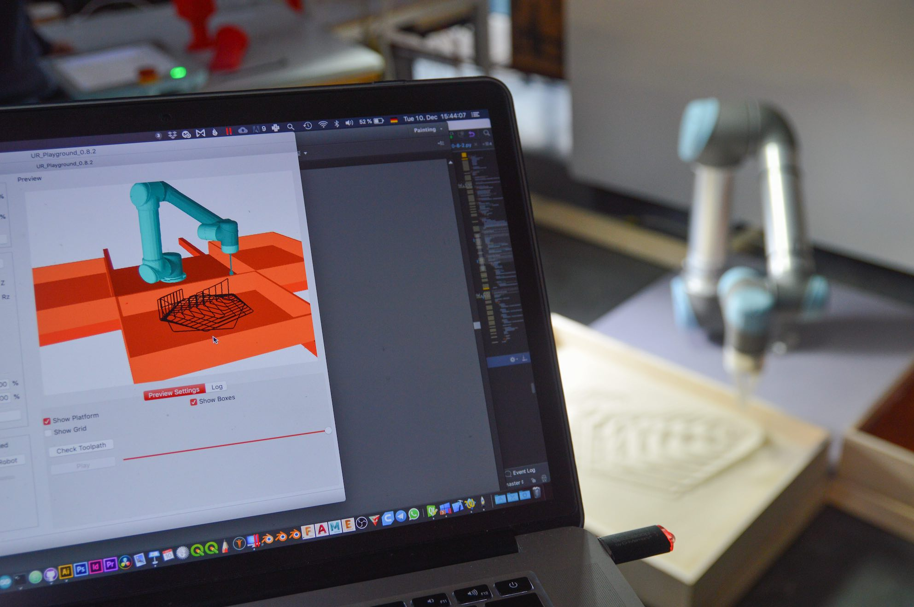
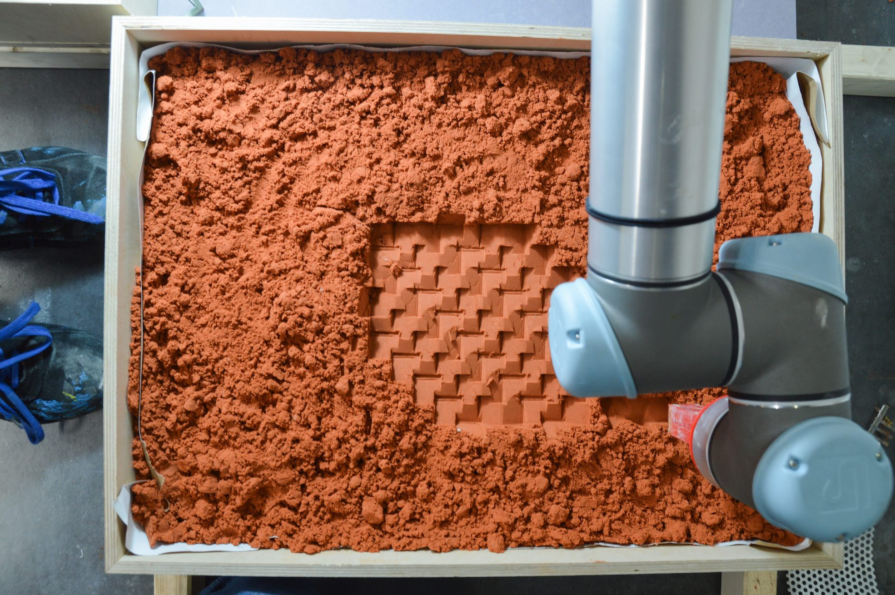
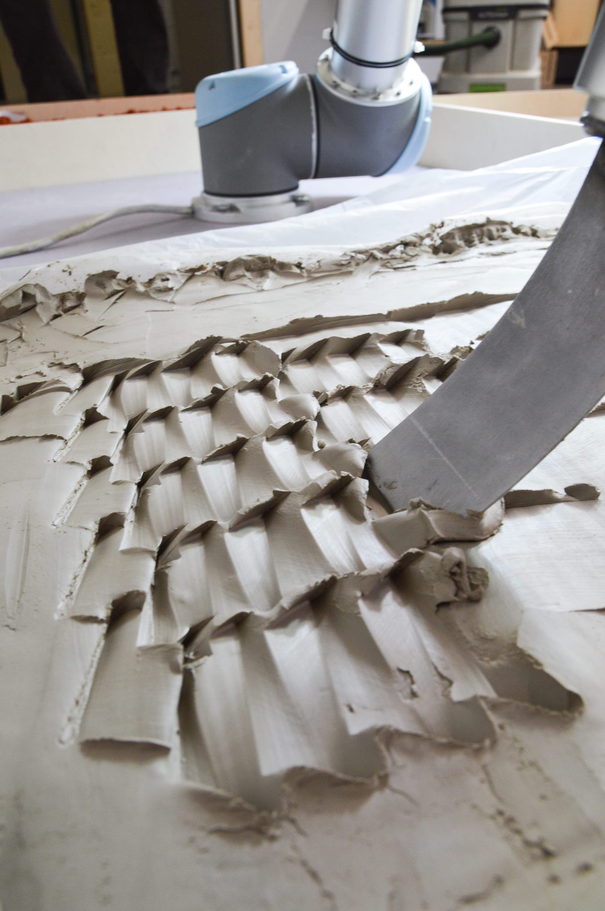
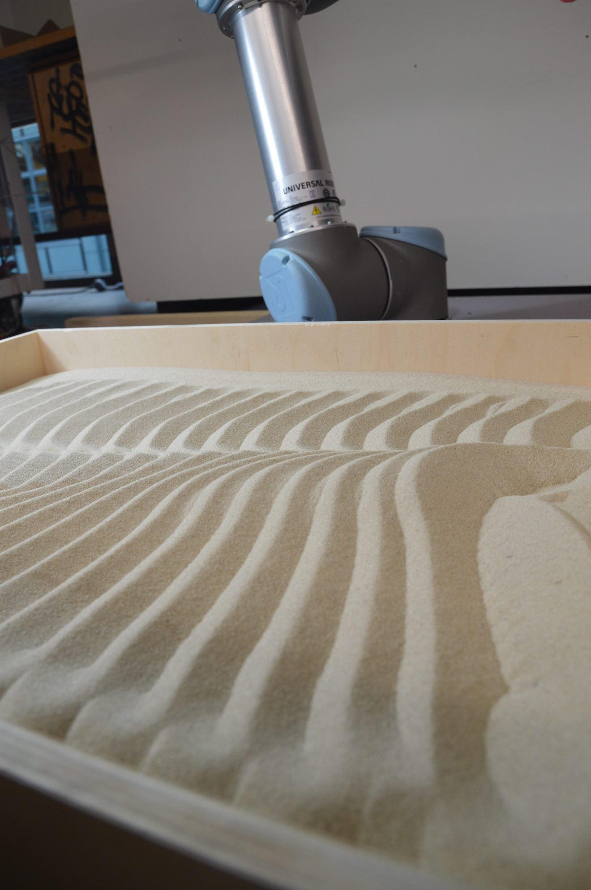

# UR_Playground

 
Simple software that takes svg files with colored paths and converts them to Robot commands.
Meant to be used as an instructional tool for workshops with universal robots. Students can start to experiment directly without learning new software.
SVG files created in illustrator or inkscape are used to control the robot. By specifying an origin coordinate these 2D files can be positioned in space.

See the releases tab to download the newest version for Mac or Windows. After download click on UR_Playgroung_0.8.3 to start the program. 

Builds ontop of:   
[sintef-manufacturing/**python-urx**](https://github.com/SintefManufacturing/python-urx)  
[khuongnguyen96/**robot-simulator**](https://github.com/khuongnguyen96/RobotSimulator)

## Example Results: 
Created during the "Robotic Texture Workshop 2019" at BURG University of Art and Design Halle, Germany. 

___

### to do:
- [ ] parse
    - [x] plunge depth
    - [x] rotation values conversion
    - [ ] ~~reverse plunge / move direction~~
    - [ ] figure out how to parse inkscape svg files
    - [ ] parse at least each gradient stop.
    - [ ] make parsing dependent on path type (line / bezier curve)
    - [ ] create interpolation curve when interpolating gradients
    - [ ] create follow path mode
    - [ ] create stomp mode

- [ ] visualise
    - [x] add origin point in visualisation
    - [ ] add direction arrow(s) to visualisation
    - [X] change robot model
    - [x] make robot model responsive
    - [x] calibrate starting angles
    - [x] inverse kinematics
    - [x] load environment
    - [ ] give possibility to load own environments

- [ ] simulate
    - [x] create list of inverse kinematic positions
    - [ ] add play function
    - [ ] time estimation

- [ ] send
    - [x] change tcp orientation
    - [x] connect button
    - [x] change units
    - [ ] make first move a movej
    - [X] get velocity and acceleration settings in percent
    - [ ] add robot status
    - [ ] connect to robot button
    - [ ] progress bar
    - [x] test unit change
    - [ ] thread / multiprocess sending process to avoid freezing the program
    - [ ] add option to stop robot
    - [ ] send first point option
    - [ ] give loop option

- [ ] other
    - [ ] Fix Rotation issues !!!
    - [x] connect Tool length UI
    - [ ] add tool rotation value
    - [x] connect IP UI
    - [x] Connect UseColOpa UI + value
    - [x] connect speed / accell UI
    - [ ] add whatis to UI elements
    - [x] logging
    - [x] connect logging to UI
    - [ ] documentation
    - [x] test rotation
    - [ ] wrap functions into try/except statements to prevent crashing

- [ ] save
    - [ ] write all settings to text file
    - [ ] get all settings from text file

- [ ] Package
    - [ ] create packages
      - [x] Windows
      - [x] Mac
      - [ ] (Linux)

- [x] TEST
- [ ] TEST
- [ ] Test !!!
